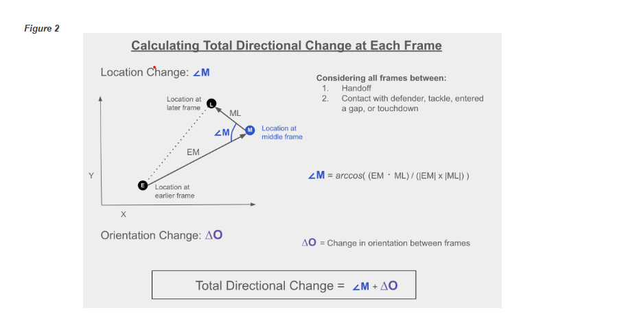
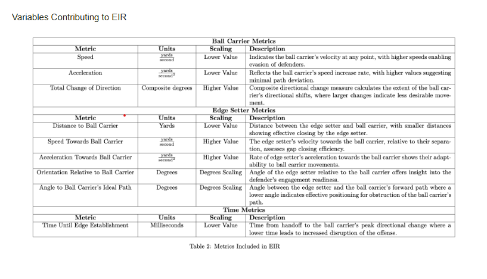

# 2024
## The Impact of Setting the Edge on Zone Run Plays** 
**Summary**
Looks at setting the edge on zone run plays and create statistic **Edge Intensity**.   

https://www.kaggle.com/code/devinbasley26/no-edge-no-chance?scriptVersionId=158207073

### Filter Methods
* Filter to run plays
* Remove runs that went to left or right end to stay within the tackles   
* 2 specific instances Uniform Directional Movement Postsnap Between Lineman and Ball Carrier    
* Selective Inclusion Plays Unique Lineman Movements in other words, lineman moved opposite everyone else looked for pulling pattern
* 2137 Xone Running Plays over the nine weeks 
* Calculated how much ball carrier changed direction in first level between handoff and first contact, tackle, passage between 2 o lineman passing all o line or touchdown

**Edge Intensity Rating**   
* Caluclated at every frame before ball carrier's greatest directional change 
* Edge setter's have to meet certain criteria to be identified as edge setters
* Made up of multiple metrics 
